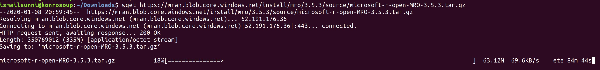
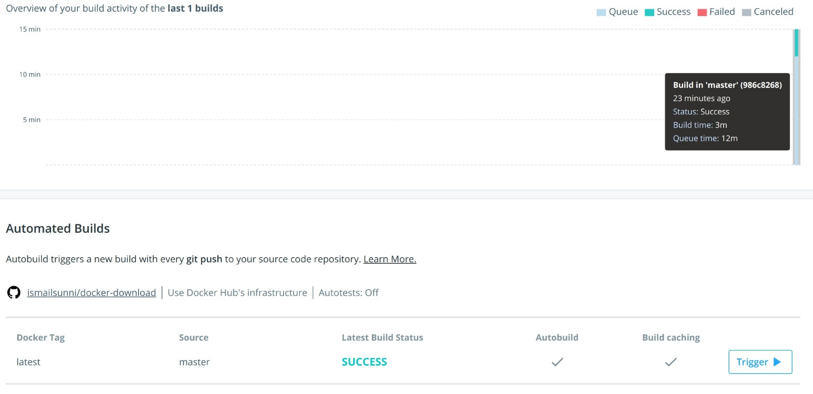
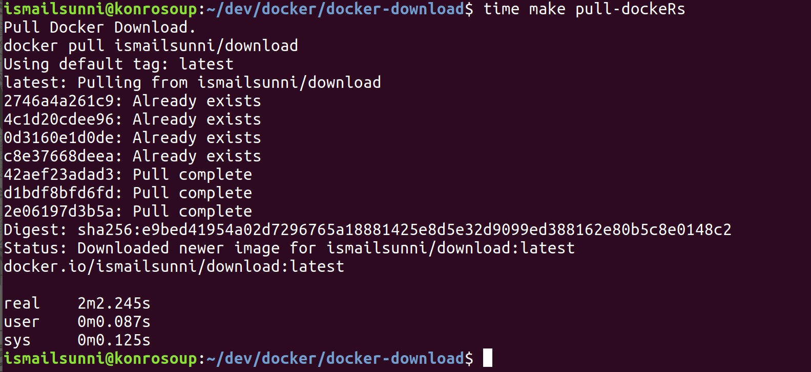

# docker-download

Just another way to download a file.

## How

1. Edit the dockerfile and add a command to download your file. E.g. `RUN wget your_file_in_the_web`
2. Let the docker hub build the Docker image.
3. After finished, pull it using this command
   `docker pull ismailsunni/download`
4. Run the container from the docker image. For example `docker run -it --rm ismailsunni/download /bin/bash`
5. Copy your file from the docker container. For example `docker cp quirky_maxwell:/home/docker/microsoft-r-open-MRO-3.5.3.tar.gz .`

## Use Case

Your internet is so slow to download a specific file from a specific website but you can access docker hub easily.

## Benchmark(?)

Manually download MRO source code : ~90 minutes

Using Docker download:

- Docker hub build: ~15 minutes
  
- Docker pull: ~2 minutes
  
- Copy from docker container to local: <1 minute (very fast)
- Update the docker file, push to github, etc: 1-5 minutes.

Total: ~20-25 minutes

## Benefit

- You don't need to make your laptop stay awake
- Backup in the cloud
- Share to other people easily
- Geek enough
